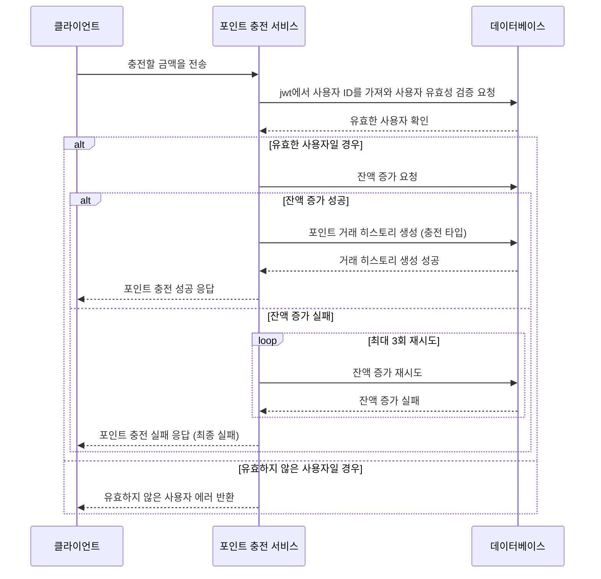
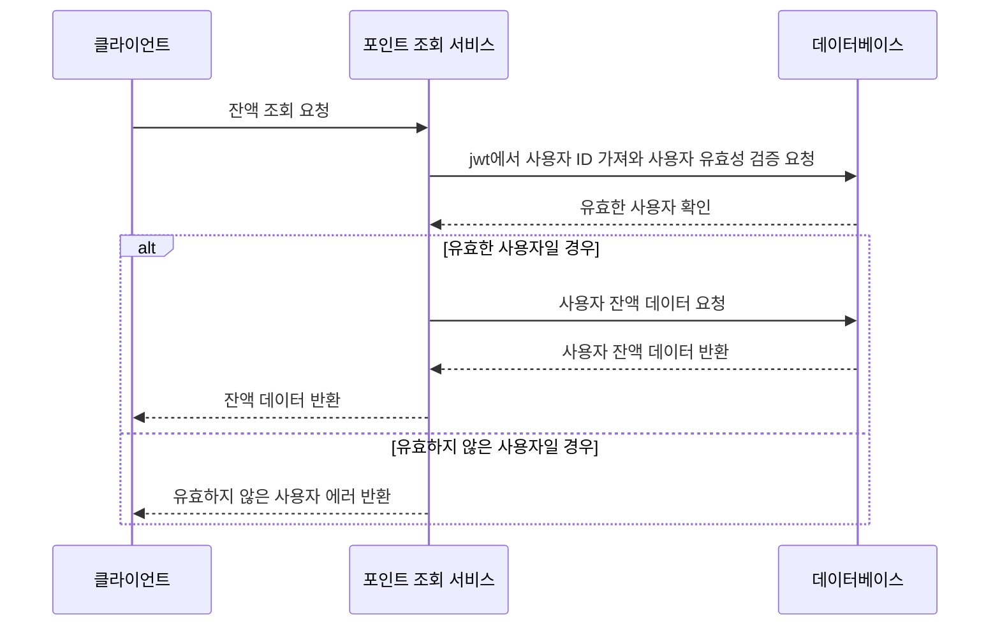
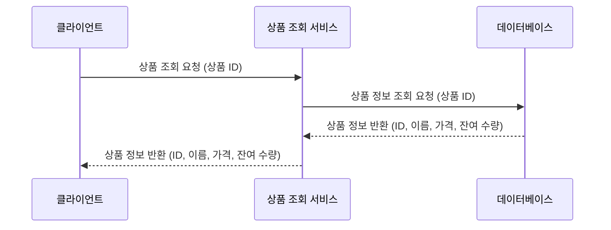
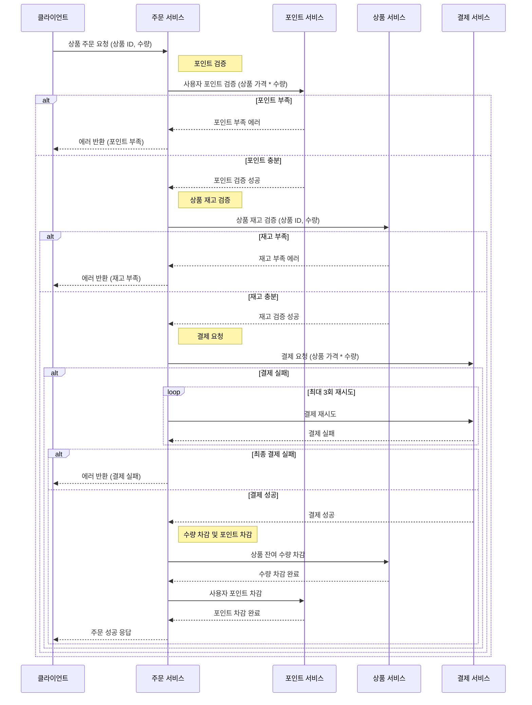
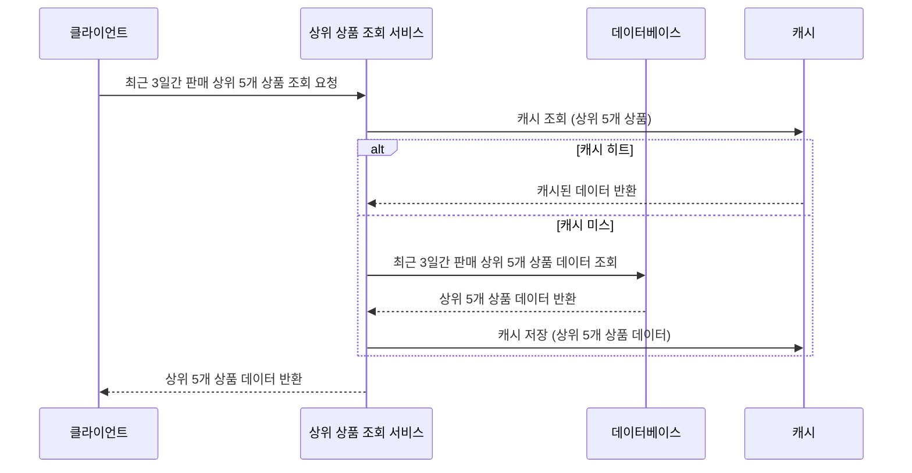

# e-commerce

## Milestone

[깃헙 마일스톤 링크](https://github.com/anniemon/e-commerce/milestones?direction=asc&sort=due_date&state=open)

## Sequence Diagram

### 포인트 충전

### 포인트 조회

### 상품 조회

### 상품 주문

### 상위 상품 조회

## Structure/Architecture

## Stack
- TypeScript + NestJS + TypeORM + MySQL
