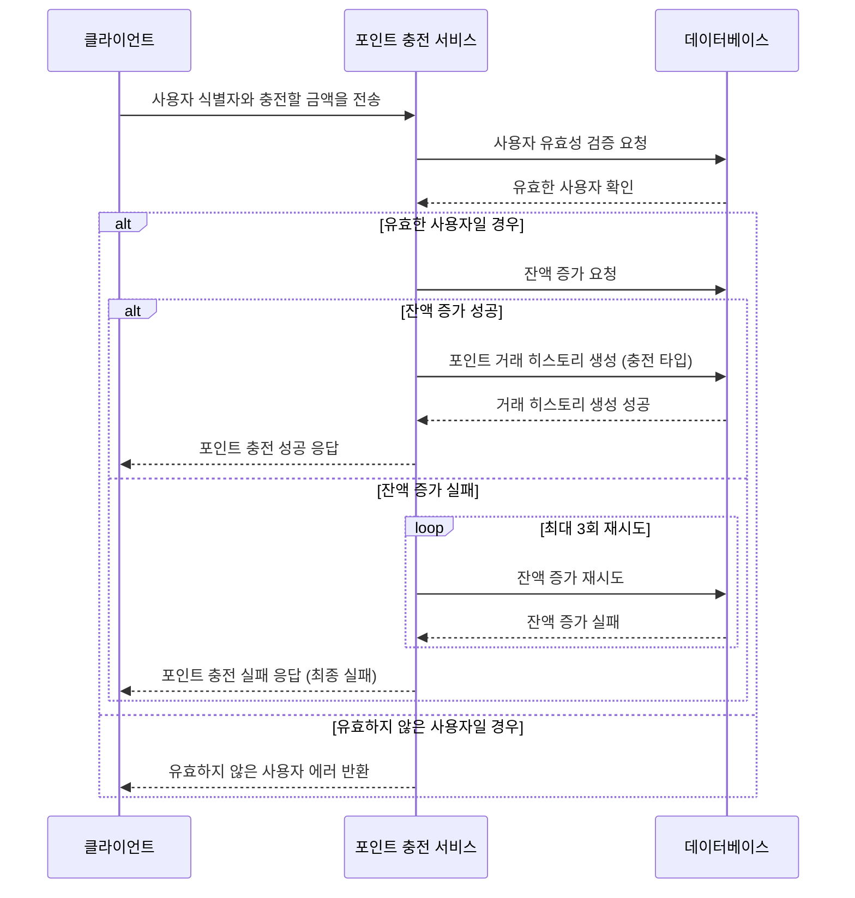
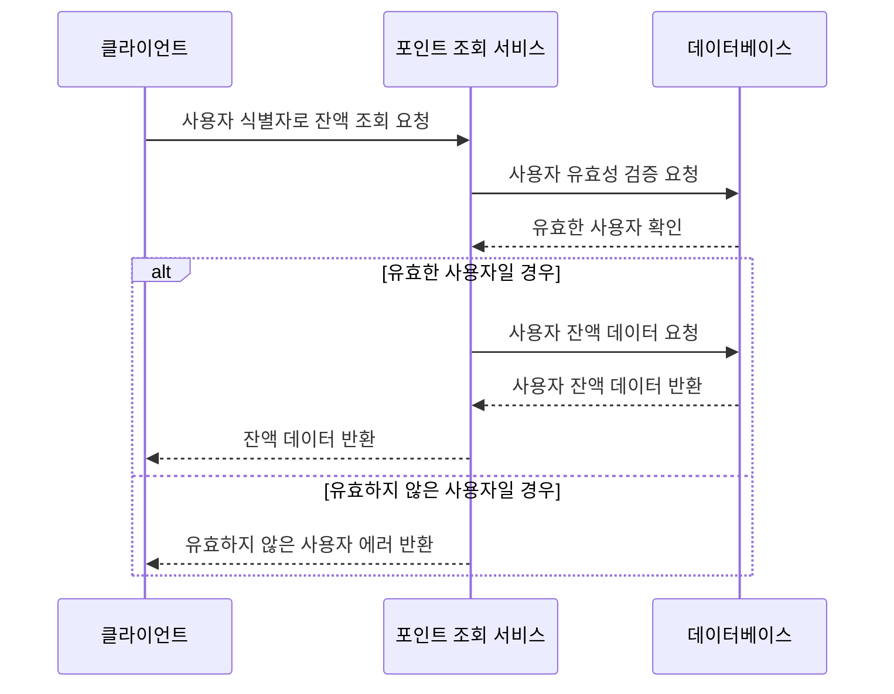
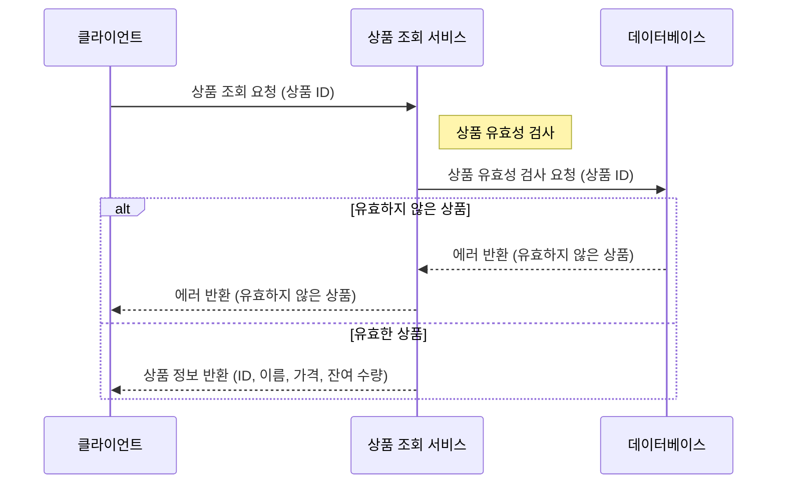
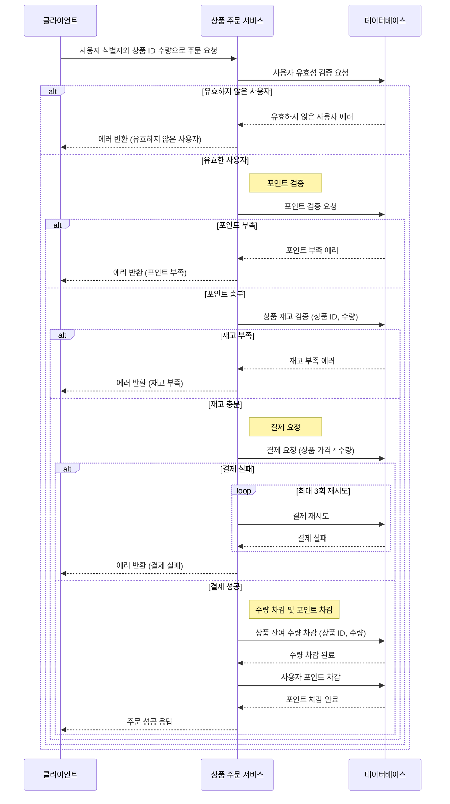
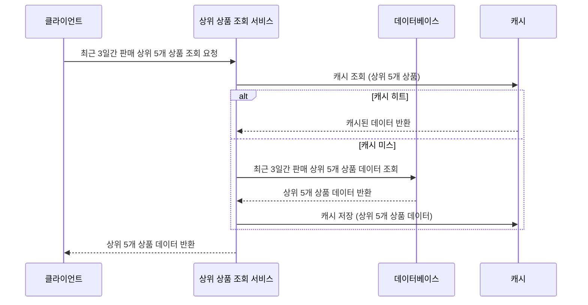
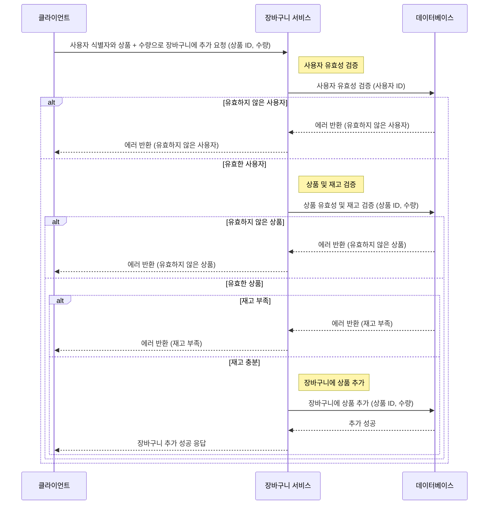
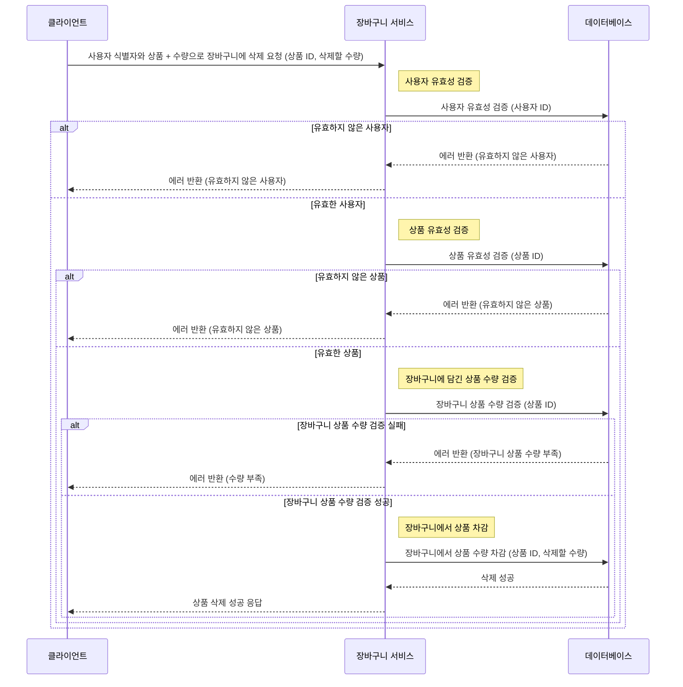
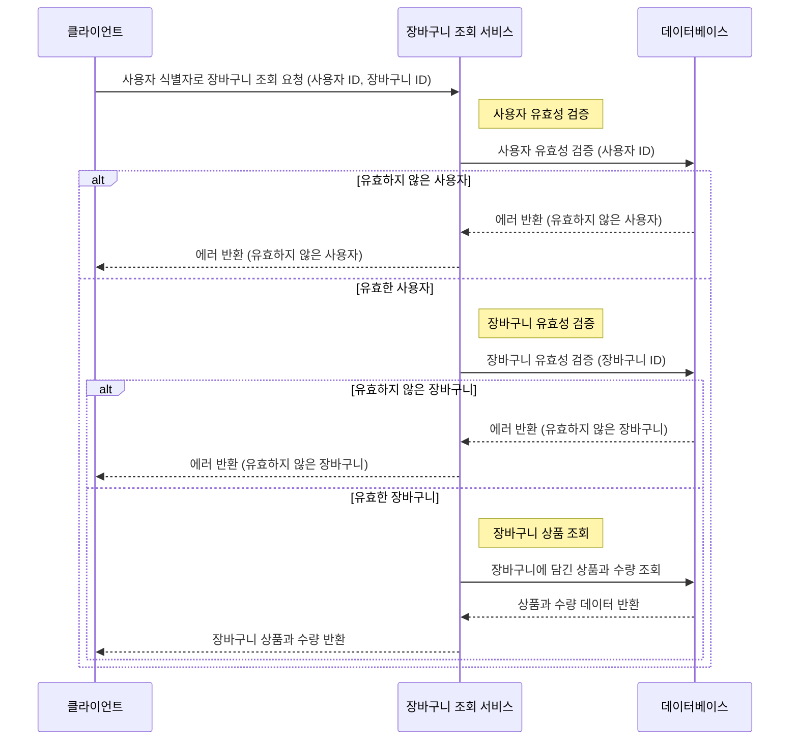

# e-commerce

## Milestone

[깃헙 마일스톤 링크](https://github.com/anniemon/e-commerce/milestones?direction=asc&sort=due_date&state=open)

## Sequence Diagram

### 포인트 충전

### 포인트 조회

### 상품 조회

### 상품 주문

### 상위 상품 조회

### 장바구니에 상품 추가

### 장바구니에 상품 삭제

### 장바구니 조회

## API docs

WIP..

## ERD
[dbdiagram.io 링크](https://dbdiagram.io/d/E-commerce-670811e697a66db9a393b7dc)

## Structure/Architecture

## Stack
- TypeScript + NestJS + TypeORM + MySQL + Redis
